<div align="center">


<br><br>

<h1>Harsheet Dwivedi</h1>
<h3>AI/ML Engineer & Open Source Contributor</h3>
<p>B.Tech Computer Science & Engineering @ BML Munjal University (2025–2029)</p>


<br>

[](https://www.linkedin.com/in/harsheet-dwivedi/)
[](mailto:dwivedi.harsheet1@gmail.com)
[](#)

</div>

<br>


> Seeking an **AI/ML Internship** to apply skills in Python, machine learning, cloud-native backend, and LLM-based multi-agent systems in a real-world product environment.

- 🏆 **Rank 39 / 26,000+** participants at India Innovates 2026 — FiSTA National Hackathon (*JanSamvaad* project).
- 🌐 **CNCF / Layer5 Contributor**: Built AI & backend features for Meshery, an open-source cloud-native platform.
- 🚀 **GSSoC 2025 & 2026** & **Hacktoberfest 2025** Open Source Contributor.

<br>


```
Languages  : Python · Java · JavaScript · Golang · SQL
ML / AI    : PyTorch · LLMs · YOLOv8 · PennyLane · NumPy · Pandas · Matplotlib · OpenCV
Web & API  : FastAPI · React · Next.js · Streamlit · HTML/CSS
Tools      : Docker · PostgreSQL · GitHub Actions · Raspberry Pi · Linux · Git
```

**Certifications:**
- 📜 **Machine Learning Specialization** — *DeepLearning.AI & Coursera* (Andrew Ng)
- 📜 **Generative AI Fundamentals** — *Google Cloud Skills Boost*

<br>


**[JanSamvaad — ResolveOS](https://github.com/Harsh33t)** &nbsp;·&nbsp; <samp>python, gemini 2.5 flash, twilio, postgresql</samp><br>
Voice-first municipal complaint system for India's 300M+ citizens (no internet required). Transcribes Hindi/English voice via Gemini 2.5 Flash, tracks SLAs, and generates ward heatmaps. **Ranked 39 / 26,000+ at India Innovates 2026.**

**[PortAI — AI Financial Intelligence Platform](https://github.com/Harsh33t/PortAI)** &nbsp;·&nbsp; <samp>fastapi, next.js, multi-agent</samp><br>
Full-stack AI financial platform with multi-agent Stratton Engine featuring 15+ investor personas (Buffett, Jhunjhunwala). Supports NSE/BSE, US equities, crypto, live USD/INR conversion & paper trading.

**[OPTICAP — AI Assistive Wearable](https://github.com/Harsh33t/OPTICAP)** &nbsp;·&nbsp; <samp>python, yolov8, mediapipe, raspberry-pi</samp><br>
Solar-assisted offline wearable cap for blind, deaf, and mute users. Uses YOLOv8-Nano for bone-conduction object narration, YAMNet for directional sound mapping, and MediaPipe for ISL gesture-to-speech.

**[Fine-Tuning LLM using Quantum Computing](https://github.com/Harsh33t/Fine-Tuning-LLM-using-QUANTIZATION)** &nbsp;·&nbsp; <samp>pennylane, pytorch, qml</samp><br>
Experimental framework integrating quantum computing principles into LLM fine-tuning workflows using PennyLane and PyTorch for hybrid classical-quantum ML.

**[GeoMIND — Mineral Intelligence Detection](https://github.com/Harsh33t/GnoMIND)** &nbsp;·&nbsp; <samp>python, sentinel-2, random-forest, groq</samp><br>
Satellite imagery application calculating spectral ratios for Iron Oxide & Clay Alteration with Random Forest ML classifier and Groq LLM report generation.

**[StartUP-Jury — AI VC Evaluator](https://github.com/Harsh33t/StartUP-Jury)** &nbsp;·&nbsp; <samp>streamlit, groq api, multi-agent</samp><br>
Multi-agent startup evaluator simulating a VC investment committee debate with 3 sequential AI agents (Optimist, Critic, Market Analyst) and downloadable PDF reports.

<br>


<div align="center">


<br>


<br>



</div>
